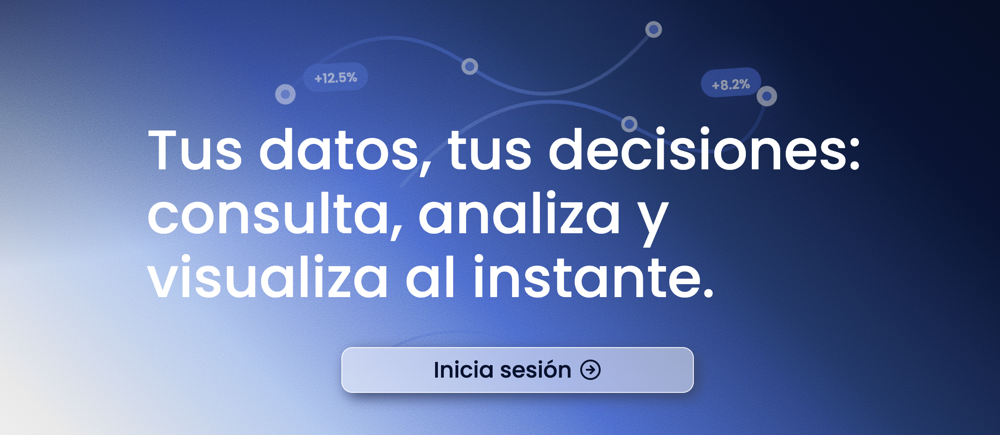

# 📨 Chatbot Interno - Proyecto Grupo 2
Sistema de chatbot interno con autenticación basada en roles y acceso a datos departamentales mediante integración con API de Data Science.



## 📄 Tabla de Contenidos
- [Características](#características)
- [Tecnologías](#tecnologías)
- [Requisitos Previos](#requisitos-previos)
- [Instalación](#instalación)
- [Configuración](#configuración)
- [Estructura del Proyecto](#estructura-del-proyecto)
- [API Endpoints](#api-endpoints)
- [Roles y Permisos](#roles-y-permisos)
- [Uso](#uso)
- [Variables de Entorno](#variables-de-entorno)
## 📲 Características
- **Autenticación JWT** - Sistema seguro de login con tokens y cookies
- **Gestión de Sesiones** - Express-session con cookies seguras
- **Sistema de Roles** - Admin, Manager y Worker con permisos diferenciados
- **Chat Inteligente** - Integración con API de Data Science para consultas contextuales
- **Visualización de Datos** - Gráficos interactivos con Chart.js
- **Estilos con Sass** - Sistema de estilos modular y mantenible
- **Filtrado por Departamento** - Acceso a información según el departamento del usuario
- **LocalStorage** - Persistencia de sesión en el navegador
- **Rutas Protegidas** - Navegación segura con verificación de autenticación
- **Encriptación bcrypt** - Passwords hasheados de forma segura


## 🛠️ Tecnologías
### Frontend
- React 18
- React Router DOM
- Chart.js (visualización de gráficos)
- Lucide React (iconos)
- Sass/SCSS (estilos)
- LocalStorage (gestión de sesión)
### Backend
- Node.js
- Express
- PostgreSQL (pg)
- JSON Web Tokens (JWT)
- bcrypt (encriptación de contraseñas)
- express-session (gestión de sesiones)
- Google OAuth (opcional)
### API Externa
- API de Data Science (Render)
## 🗝️ Requisitos Previos
- Node.js v16 o superior
- PostgreSQL 14 o superior
- npm o yarn
- Git
## 🛠️ Instalación
### 1. Clonar el repositorio
```bash
git clone <url-del-repositorio>
cd proyecto-chatbot-grupo-2
```
### 2. Instalar dependencias del Backend
```bash
cd backend
npm install
```
### 3. Instalar dependencias del Frontend
```bash
cd ../frontend
npm install
```
### 4. Configurar la Base de Datos
Ejecuta el archivo `queries.sql` que está en la carpeta `backend`:
```bash
# Conectar a PostgreSQL
psql -U postgres
# Crear la base de datos
CREATE DATABASE chatbot_db;
# Conectar a la base de datos
\c chatbot_db
# Ejecutar el script SQL
\i /ruta/a/tu/proyecto/backend/queries.sql
```
O copia y ejecuta el contenido del archivo `queries.sql` directamente en pgAdmin o tu cliente PostgreSQL favorito.

## 📁 Estructura del Proyecto
```
proyecto-chatbot-grupo-2/
│
├── backend/
│   ├── config/
│   │   ├── db_pgsql.js         
│   │   └── googleAuth.js        
│   ├── controllers/
│   │   └── user.controller.js    
│   ├── middlewares/
│   │   ├── authMiddleware.js     
│   │   ├── error404.js           
│   │   └── validateField.js  
│   ├── models/
│   │   └── user.model.js        
│   ├── queries/
│   │   └── user.queries.js     
│   ├── routes/
│   │   └── user.routes.js    
│   ├── services/
│   │   └── email_services.js   
│   ├── validator/
│   │   └── users.validator.js    
│   ├── .env                     
│   ├── .env.example             
│   ├── .gitignore
│   ├── app.js                  
│   ├── package.json
│   ├── package-lock.json
│   └── queries.sql              
│
├── frontend/
│   ├── public/
│   │   ├── _headers           
│   │   └── vite.svg           
│   ├── src/
│   │   ├── assets/
│   │   │   └── react.svg
│   │   ├── components/
│   │   │   ├── Footer/
│   │   │   ├── Header/
│   │   │   ├── Home/
│   │   │   ├── Main/
│   │   │   │   ├── ChangePassword/
│   │   │   │   ├── Chat/
│   │   │   │   │   ├── ChartRenderer/
│   │   │   │   │   │   ├── ChartRenderer.css
│   │   │   │   │   │   └── ChartRenderer.jsx
│   │   │   │   │   ├── Chat.css
│   │   │   │   │   ├── Chat.jsx
│   │   │   │   │   └── index.js
│   │   │   │   ├── Dashboards/
│   │   │   │   │   ├── AdminDashboard/
│   │   │   │   │   ├── ManagerDashboard/
│   │   │   │   │   ├── WorkerDashboard/
│   │   │   │   │   ├── Dashboards.css
│   │   │   │   │   ├── Dashboards.jsx
│   │   │   │   │   └── index.js
│   │   │   │   ├── Login/
│   │   │   │   │   ├── LoginForm/
│   │   │   │   │   │   └── index.js
│   │   │   │   │   ├── Login.css
│   │   │   │   │   └── Login.jsx
│   │   │   │   ├── SignUp/
│   │   │   │   │   ├── SignUpForm/
│   │   │   │   │   │   └── index.js
│   │   │   │   │   ├── SignUp.css
│   │   │   │   │   └── SignUp.jsx
│   │   │   │   ├── UsersList/
│   │   │   │   │   ├── UserCard/
│   │   │   │   │   │   └── index.js
│   │   │   │   │   ├── UsersList.css
│   │   │   │   │   ├── UsersList.jsx
│   │   │   │   │   └── index.js
│   │   │   │   ├── Main.css
│   │   │   │   └── Main.jsx
│   │   ├── service/
│   │   │   ├── chat.service.js      
│   │   │   └── users.service.js     
│   │   ├── styles/
│   │   │   ├── App.css
│   │   │   └── index.css
│   │   ├── App.jsx                  
│   │   └── main.jsx              
│   ├── .env                         
│   ├── .env.example
│   ├── .gitignore
│   ├── eslint.config.js
│   ├── index.html
│   ├── package.json
│   ├── package-lock.json
│   └── vite.config.js                   
│
├── .gitignore
├── package.json
├── Dockerfile                  
└── README.md
```
## 🔗 API Endpoints
### API de Data Science
**URL Base:** `https://proyecto-chat-bot-grupo-2.onrender.com/`
#### Endpoints disponibles:
1. **Bienvenida**
   - `GET /`
   - Mensaje de bienvenida de la API
2. **Health Check**
   - `GET /health`
   - Verificar estado de la API
3. **Query Principal**
   - `POST /query`
   - Body:
     ```json
     {
       "question": "¿Cuál es el precio del producto X?",
       "department": "ventas"
     }
     ```
### Backend Interno
**URL Base:** `http://localhost:4000/api`
#### Autenticación:
- **`POST /api/login`** - Iniciar sesión
  - Body:
    ```json
    {
      "email": "usuario@empresa.com",
      "password": "contraseña123"
    }
    ```
  - Response:
    ```json
    {
      "token": "jwt_token_aqui",
      "user": {
        "id": 1,
        "nombre": "Usuario",
        "email": "usuario@empresa.com",
        "rol": "manager",
        "departamento": "ventas"
      }
    }
    ```
- **`POST /api/signup`** - Registrar nuevo usuario (requiere token de admin/manager)
  - Headers: `Authorization: Bearer <token>`
  - Body:
    ```json
    {
      "nombre": "Nuevo Usuario",
      "email": "nuevo@empresa.com",
      "password": "password123",
      "rol": "worker",
      "departamento": "ventas"
    }
    ```
- **`GET /api/logout`** - Cerrar sesión
  - Limpia cookies y destruye sesión
  - Response:
    ```json
    {
      "message": "Logout exitoso"
    }
    ```
#### Gestión de Usuarios:
- **`GET /api/managers`** - Listar todos los managers (requiere token)
  - Headers: `Authorization: Bearer <token>`
  - Response: Array de managers
- **`GET /api/workers`** - Listar todos los workers (requiere token)
  - Headers: `Authorization: Bearer <token>`
  - Response: Array de workers
- **`DELETE /api/:email`** - Eliminar usuario por email (requiere token)
  - Headers: `Authorization: Bearer <token>`
  - Params: `email` del usuario a eliminar
- **`PUT /api/change-password`** - Cambiar contraseña
  - Body:
    ```json
    {
      "email": "usuario@empresa.com",
      "oldPassword": "contraseñaAntigua",
      "newPassword": "contraseñaNueva"
    }
    ```
#### Chat:
- **`POST /api/chat`** - Enviar mensaje al chatbot
  - Headers: `Authorization: Bearer <token>`
  - Body:
    ```json
    {
      "query": "pregunta del usuario",
      "user_id": 1,
      "department": "ventas"
    }
    ```
## 👤 Roles y Permisos
### Admin
- Crear nuevos Managers
- Ver lista de usuarios
- Acceder al chat
- Cambiar contraseña
- Acceso a todos los departamentos
### Manager
- Crear Workers
- Acceder al chat
- Cambiar contraseña
- Acceso solo a su departamento
### Worker
- Acceder al chat
- Cambiar contraseña
- Acceso solo a su departamento


## 🖥️ Uso
### 1. Iniciar el Backend
```bash
cd backend
npm run dev
```
El servidor estará corriendo en `http://localhost:4000`
### 2. Iniciar el Frontend
```bash
cd frontend
npm run dev
```
La aplicación estará disponible en `http://localhost:5173`

### 4. Flujo de Uso
1. **Login** → Iniciar sesión con credenciales
2. **Dashboard** → Acceder al panel según tu rol
3. **Chat** → Hacer consultas relacionadas con tu departamento
4. **Gestión** → Administrar usuarios (según permisos)
